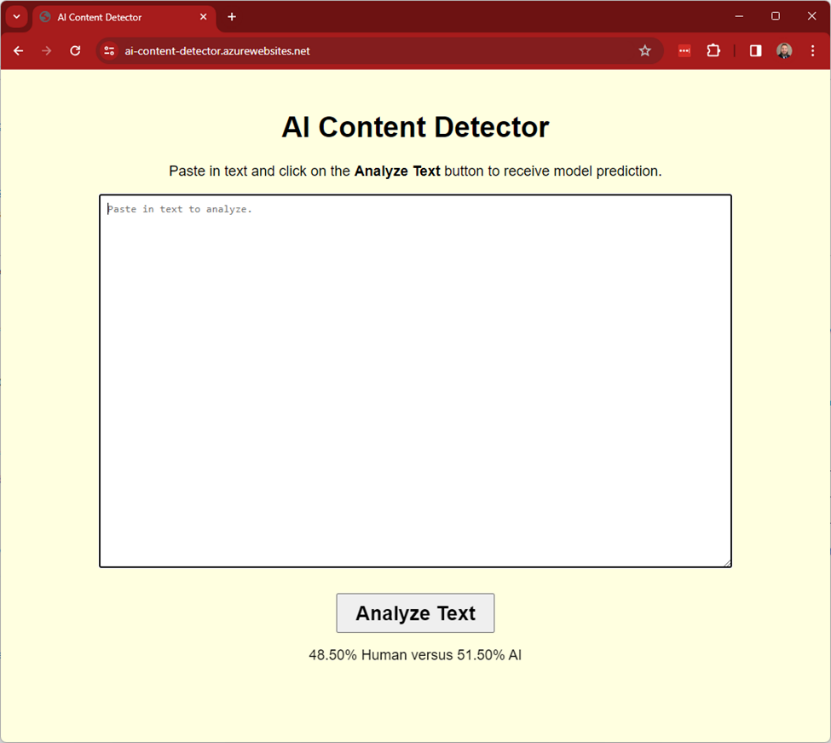

# AI Content Detector: Human versus AI Distinguishment

This project is a part of the AAI-590 Capstone Project course in the Applied Artificial Intelligence Program at 
the University of San Diego (USD).

### <b>Project Status: In Progress (Planned Completion: 4/15/2024)</b>

## Flask Web Application

https://ai-content-detector.azurewebsites.net/

***Note** - This web app will only be available for up to 30 days following project completion.

## Installation

To create a copy of the repository on your local device, use the following commands:

`git init`

`git clone https://github.com/jeraimondi/aai-capstone-ai-content-detector.git`

## Project Intro

With recent advancements in Artificial Intelligence (AI), it is becoming increasingly difficult to distinguish
between human versus AI-generated content, which creates challenges in verifying content authenticity. This 
presents concerns in areas such as news feeds, social media, and academic integrity where content authenticity 
is crucial. This project aims to address this issue by developing and comparing the performance of both 
traditional machine learning algorithms and multiple deep learning models in a binary classification task (i.e., 
human versus AI-generated text).

## Project Objectives

* Primary Goal
  * Develop a Machine Learning (ML) model that can predict and provide the probability of text being
    human or AI-generated
* Secondary Goal
  * Develop an interactive web app for users to interact with the model

## Contributors

* [Jason Raimondi](https://github.com/jeraimondi)
* [Jeremy Cryer](https://github.com/jerm914)
* [Shane Schipper](https://github.com/SchipDev)

## Methods Used

* Machine Learning
* Deep Learning
* Containerization

## Technologies

* Python
* PyTorch
* Flask
* Gunicorn
* Azure
* Docker

## Project Description

As part of this project, we approach the problem by developing multiple models for comparison. We develop models 
utilizing more simplistic, traditional algorithms, as well as a custom transformer model using the PyTorch machine 
learning framework. Additionally, we also use a pretrained DistilBERT transformer model to provide a comprehensive 
performance comparison across multiple model architectures.

Following model selection, we develop an interactive web application that allows users to input text and receive 
predictions on whether it was human or AI-generated, along with the associated probability. An application such as 
this can be used in the real-world for educators, content moderators, and the general public to combat some of the 
aforementioned growing concerns.

Ultimately, the team's efforts resulted in selection of our custom transformer model as the best option. We proceed 
to develop a Flask web application with an HTML front-end and Gunicorn as a Python Web Server Gateway Interface (WSGI) 
HTTP Server for UNIX. We then utilize Docker in our local development environment to build a Docker image, run a container, 
and test web app functionality. Afterwards, we push the container to a private Azure Container Registry (ACR) which is 
part of a resource group available to the web app. We create the web app, specifying the container, and deploy to 
the Azure cloud platform to make it publicly available.

### Data Sources

[Kaggle - AI Vs Human Text](https://www.kaggle.com/datasets/shanegerami/ai-vs-human-text)

Classes of the dataset include:
* 0 - Human
* 1 - AI

[Kaggle - Detect- AI Generated VS Student Generated Text](https://www.kaggle.com/datasets/prajwaldongre/llm-detect-ai-generated-vs-student-generated-text)

***Note** - This dataset was only used for additional inference testing, as it provided more text diversity (i.e., variable 
length, writing styles).

Classes of the dataset include:
* student - Human
* ai - AI

## License

[MIT License](LICENSE)

## Acknowledgments
Thank you to all the USD professors. Special thanks to Professor Marbut for your continued dedication, guidance, and 
support throughout this course.

## References

*Deploy a containerized Flask or FastAPI web app on Azure App Service*. (2023, December 7). Microsoft Learn. 
&nbsp;&nbsp;&nbsp;&nbsp;&nbsp;&nbsp;&nbsp;&nbsp;&nbsp;https://learn.microsoft.com/en-us/azure/developer/python/tutorial-containerize-simple-web-app-for-app-service?tabs=web-app-flask

*Language modeling with nn.transformer and torchtext*. PyTorch. (n.d.). 
&nbsp;&nbsp;&nbsp;&nbsp;&nbsp;&nbsp;&nbsp;&nbsp;&nbsp;https://pytorch.org/tutorials/beginner/transformer_tutorial.html

Ongko, G. C. (2022, February 3). *Building a machine learning web application using flask*. Medium. 
&nbsp;&nbsp;&nbsp;&nbsp;&nbsp;&nbsp;&nbsp;&nbsp;&nbsp;https://towardsdatascience.com/building-a-machine-learning-web-application-using-flask-29fa9ea11dac

Paszke, A., Gross, S., Massa, F., Lerer, A., Bradbury, J., Chanan, G., Killeen, T., Lin, Z., Gimelshein, N., Antiga, L., 
&nbsp;&nbsp;&nbsp;&nbsp;&nbsp;&nbsp;&nbsp;&nbsp;&nbsp;Desmaison, A., Kopf, A., Yang, E., DeVito, Z., Raison, M., Tejani, A., Chilamkurthy, S., Steiner, B., Fang, L., 
&nbsp;&nbsp;&nbsp;&nbsp;&nbsp;&nbsp;&nbsp;&nbsp;&nbsp;… Chintala, S. (2019). PyTorch: An Imperative Style, High-PerformanceHigh-Performance Deep Learning Library. 
&nbsp;&nbsp;&nbsp;&nbsp;&nbsp;&nbsp;&nbsp;&nbsp;&nbsp;Advances in Neural Information Processing Systems 32, 8024–8035. 
&nbsp;&nbsp;&nbsp;&nbsp;&nbsp;&nbsp;&nbsp;&nbsp;&nbsp;http://papers.neurips.cc/paper/9015-pytorch-an-imperative-style-high-performance-deep-learning-library.pdf
